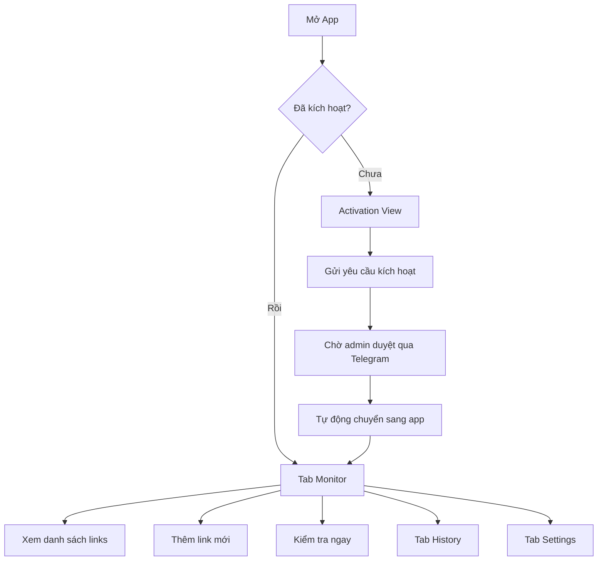

<p align="center">
  
</p>

<h1 align="center">✈️ TestFlight Slot Monitor</h1>

<p align="center">
  <strong>Hệ thống theo dõi slot TestFlight tự động — iOS App + Python Server + Telegram Bot</strong>
</p>

<p align="center">
  
  
  
  
  
</p>

---

## 📋 Mục Lục

- [Giới thiệu](#-giới-thiệu)
- [Kiến trúc hệ thống](#-kiến-trúc-hệ-thống)
- [Tính năng](#-tính-năng)
- [Cấu trúc dự án](#-cấu-trúc-dự-án)
- [Cài đặt & Triển khai](#-cài-đặt--triển-khai)
- [Cấu hình](#-cấu-hình)
- [API Reference](#-api-reference)
- [Telegram Bot](#-telegram-bot)
- [iOS App](#-ios-app)
- [Bảo mật](#-bảo-mật)
- [License](#-license)

---

## 🎯 Giới Thiệu

**TestFlight Slot Monitor** là một hệ thống hoàn chỉnh giúp theo dõi trạng thái slot TestFlight beta trên Apple. Khi có slot trống, hệ thống sẽ **thông báo ngay lập tức** qua:

- 🔔 **Push Notification** trên iOS  
- 🤖 **Telegram Bot** với nút bấm nhanh  
- 📱 **iOS App** với giao diện real-time  

> **Tại sao cần?** Slot TestFlight thường hết rất nhanh. Hệ thống này kiểm tra liên tục (tối thiểu 5 giây/lần) và báo ngay khi có slot, giúp bạn không bỏ lỡ cơ hội.

---

## 🏗 Kiến Trúc Hệ Thống

```
┌─────────────────┐         ┌──────────────────────┐         ┌──────────────┐
│   iOS App       │◄───────►│   Python Server      │◄───────►│   MongoDB    │
│  (SwiftUI)      │  REST   │  (HTTP + Telegram)   │         │   Atlas      │
│                 │   API   │                      │         │              │
│ • Monitor View  │         │ • REST API (:8080)   │         │ • links      │
│ • History View  │         │ • TestFlight Checker │         │ • settings   │
│ • Settings      │         │ • Periodic Checker   │         │ • devices    │
│ • Activation    │         │ • Telegram Poller    │         │ • history    │
│ • Background    │         │                      │         │ • counters   │
│   Tasks         │         └──────────┬───────────┘         └──────────────┘
└─────────────────┘                    │
                                       │ Telegram API
                              ┌────────▼────────┐
                              │  Telegram Bot   │
                              │                 │
                              │ • Inline Buttons│
                              │ • Admin Panel   │
                              │ • Alert System  │
                              └─────────────────┘
```

---

## ✨ Tính Năng

### 🖥 Server (Python)
| Tính năng | Mô tả |
|-----------|--------|
| 🔍 **TestFlight Scraper** | Phân tích HTML trang TestFlight, phát hiện trạng thái slot |
| 🔄 **Periodic Checker** | Kiểm tra tự động theo chu kỳ (5s – 86400s) |
| 🌐 **REST API** | API đầy đủ cho iOS app (CRUD links, check, status) |
| 🤖 **Telegram Bot** | Quản lý qua Telegram với inline buttons |
| 📱 **Device Activation** | Hệ thống kích hoạt thiết bị qua mã code |
| 📊 **History Tracking** | Lưu lịch sử thay đổi trạng thái (TTL 30 ngày) |
| 🔑 **API Key Auth** | Xác thực API bằng header `X-API-Key` |

### 📱 iOS App (SwiftUI)
| Tính năng | Mô tả |
|-----------|--------|
| 🎨 **Dark UI Premium** | Giao diện tối với gradient, glassmorphism, micro-animations |
| 📋 **Monitor Dashboard** | Bảng điều khiển real-time hiển thị tất cả link |
| ➕ **Add/Remove Links** | Thêm/xóa link TestFlight từ app |
| 🔔 **Push Notifications** | Thông báo ngay khi trạng thái thay đổi |
| ⏱ **Background Tasks** | Tiếp tục kiểm tra khi app ở background |
| 🔐 **Device Activation** | Yêu cầu admin duyệt trước khi sử dụng |
| 📜 **History View** | Xem lịch sử các lần slot mở |
| ⚙️ **Settings** | Cấu hình server URL, API key, interval |
| 🔄 **Pull-to-Refresh** | Kéo xuống để kiểm tra ngay |

### 🤖 Telegram Bot
| Tính năng | Mô tả |
|-----------|--------|
| 📊 **Status Dashboard** | Xem trạng thái server qua inline buttons |
| ✅ **Approve/Reject** | Duyệt/từ chối yêu cầu kích hoạt thiết bị |
| 🗑 **Revoke Access** | Thu hồi quyền truy cập thiết bị |
| 📋 **Device List** | Xem danh sách thiết bị đã kích hoạt |
| 🚨 **Real-time Alerts** | Thông báo ngay khi slot thay đổi |
| 📱 **Interactive Menu** | Menu nút bấm, không cần gõ lệnh |

---

## 📁 Cấu Trúc Dự Án

```
TestFlightSlotMonitor-App/
│
├── 📱 TestFlightSlotMonitor/              # iOS App (SwiftUI)
│   ├── TestFlightSlotMonitorApp.swift      # Entry point, notification delegate
│   ├── Assets.xcassets/                    # App icons & colors
│   │
│   ├── Views/
│   │   ├── ContentView.swift              # Tab navigation (Monitor/History/Settings)
│   │   ├── ActivationView.swift           # Device activation gate
│   │   ├── MonitorView.swift              # Main dashboard
│   │   ├── LinkCardView.swift             # Individual link card component
│   │   ├── AddLinkSheet.swift             # Add new link sheet
│   │   ├── HistoryView.swift              # Slot change history
│   │   ├── SettingsView.swift             # Server & app configuration
│   │   └── CountdownView.swift            # Next check countdown
│   │
│   └── Services/
│       ├── MonitorService.swift           # Core monitoring logic, background tasks
│       └── APIClient.swift                # REST API client (actor-based)
│
├── 🐍 server/                             # Python Backend
│   ├── server.py                          # Production server (MongoDB + Telegram + API)
│   ├── server_local.py                    # Local dev server (in-memory, no MongoDB)
│   ├── bot.py                             # Telegram bot (python-telegram-bot version)
│   ├── checker.py                         # TestFlight page scraper
│   ├── database.py                        # MongoDB operations (links, settings, counters)
│   ├── config.py                          # Environment configuration loader
│   ├── api.py                             # Flask REST API (alternative)
│   ├── locales.py                         # Bilingual messages (VI/EN)
│   ├── requirements.txt                   # Python dependencies
│   ├── start.sh                           # Production startup script
│   ├── .env.example                       # Environment template
│   └── .env                               # Environment variables (gitignored)
│
├── TestFlightSlotMonitor.xcodeproj/       # Xcode project
└── Info.plist                             # Background task identifiers
```

---

## 🚀 Cài Đặt & Triển Khai

### Yêu cầu

| Thành phần | Yêu cầu |
|------------|----------|
| **Python** | 3.10+ |
| **iOS** | 17.0+ (SwiftUI, Observation framework) |
| **Xcode** | 15.0+ |
| **MongoDB** | Atlas (free tier OK) hoặc local |
| **Telegram Bot** | Token từ [@BotFather](https://t.me/BotFather) |

### 1️⃣ Cài đặt Server

```bash
# Clone repository
git clone https://github.com/ThanhDora/TestFlight-Slot-Monitor-Bot.git
cd TestFlight-Slot-Monitor-Bot/TestFlightSlotMonitor-App/server

# Tạo file cấu hình
cp .env.example .env

# Chỉnh sửa .env
nano .env

# Cài dependencies
pip3 install -r requirements.txt

# Chạy production server
python3 server.py

# Hoặc chạy local dev server (không cần MongoDB)
python3 server_local.py
```

### 2️⃣ Cài đặt iOS App

```bash
# Mở Xcode project
open TestFlightSlotMonitor.xcodeproj

# Build & Run trên thiết bị thật (cần cho background tasks)
# Cmd + R
```

> ⚠️ **Lưu ý**: Background tasks chỉ hoạt động trên thiết bị thật, không hoạt động trên Simulator.

### 3️⃣ Sử dụng Script khởi động

```bash
chmod +x start.sh
./start.sh
```

Script sẽ tự động:
- Kiểm tra Python
- Cài dependencies nếu cần
- Kiểm tra file `.env`
- Hiển thị IP & port để iOS app kết nối
- Khởi chạy server

---

## ⚙️ Cấu Hình

### Biến môi trường (`.env`)

```env
# ── Telegram ──
BOT_TOKEN=your_bot_token_here          # Token từ @BotFather
OWNER_ID=your_user_id_here             # ID Telegram của bạn (@userinfobot)

# ── MongoDB ──
MONGO_URI=mongodb+srv://...            # Connection string
MONGO_DB_NAME=testflight_monitor       # Tên database

# ── Server ──
DEFAULT_INTERVAL=60                    # Chu kỳ kiểm tra mặc định (giây)
REQUEST_TIMEOUT=15                     # Timeout HTTP (giây)
API_HOST=0.0.0.0                       # Bind address
API_PORT=8080                          # Port
API_KEY=your_secret_api_key_here       # API key cho iOS app
```

### MongoDB Collections

| Collection | Mô tả |
|-----------|--------|
| `links` | Danh sách link TestFlight đang theo dõi |
| `settings` | Cài đặt bot (interval, language) |
| `devices` | Thiết bị đã yêu cầu kích hoạt |
| `history` | Lịch sử thay đổi slot (TTL 30 ngày) |
| `counters` | Auto-increment ID cho links |

---

## 📡 API Reference

Base URL: `http://<server-ip>:8080`

### Authentication

Tất cả endpoint (trừ `/health` và `/api/auth/*`) yêu cầu header:

```
X-API-Key: <your_api_key>
```

### Endpoints

#### Health Check
```http
GET /health
```
```json
{"status": "ok"}
```

---

#### Get All Links
```http
GET /api/links
```
```json
{
  "links": [
    {
      "id": 1,
      "url": "https://testflight.apple.com/join/AbCdEf",
      "app_name": "MyApp",
      "status": "available",
      "added_at": "2026-05-17T12:00:00",
      "last_checked": "2026-05-17T15:30:00",
      "last_status_change": "2026-05-17T14:00:00"
    }
  ],
  "count": 1,
  "timestamp": "2026-05-17T15:30:00"
}
```

---

#### Add Link
```http
POST /api/links
Content-Type: application/json

{"url": "https://testflight.apple.com/join/AbCdEf"}
```
```json
{"success": true, "app_name": "MyApp", "status": "available"}
```

---

#### Delete Link
```http
DELETE /api/links/{id}
```
```json
{"success": true, "removed": {...}}
```

---

#### Trigger Check
```http
POST /api/check
```
```json
{
  "checked": 3,
  "results": [
    {"id": 1, "app_name": "MyApp", "old_status": "full", "new_status": "available", "changed": true}
  ],
  "timestamp": "..."
}
```

---

#### Server Status
```http
GET /api/status
```
```json
{
  "status": "running",
  "link_count": 5,
  "check_interval": 60,
  "timestamp": "..."
}
```

---

#### Set Interval
```http
PUT /api/settings/interval
Content-Type: application/json

{"seconds": 30}
```
```json
{"success": true, "interval": 30}
```

---

#### Device Activation Request (No API Key)
```http
POST /api/auth/request
Content-Type: application/json

{"code": "A1B2C3D4", "device_name": "iPhone 16 Pro"}
```
```json
{"approved": false, "pending": true}
```

---

#### Check Activation Status (No API Key)
```http
GET /api/auth/status?code=A1B2C3D4
```
```json
{"approved": true, "pending": false}
```

---

#### Get History
```http
GET /api/history
```
```json
{
  "history": [
    {"app_name": "MyApp", "url": "...", "old_status": "full", "new_status": "available", "timestamp_iso": "..."}
  ],
  "count": 10
}
```

---

## 🤖 Telegram Bot

### Interactive Menu

Khi server khởi động, bot sẽ gửi menu với các nút bấm:

```
✈️ TestFlight Monitor

[📊 Status]  [📋 Devices]
[❓ Help]
```

### Quản lý thiết bị

Khi iOS app gửi yêu cầu kích hoạt, admin nhận thông báo:

```
📱 Yêu cầu kích hoạt mới

Mã: A1B2C3D4
Thiết bị: iPhone 16 Pro

[✅ Duyệt]  [❌ Từ chối]
```

### Status Dashboard

```
📊 Server Status

🔗 Links: 5
✅ Có slot: 2
🔴 Hết slot: 3
📱 Thiết bị: 1/2
⏱ Interval: 60s

[⬅ Quay lại]
```

### Cảnh báo tự động

```
✅ MyApp
Status: full → available
Link: https://testflight.apple.com/join/...
```

### Text Commands (Fallback)

| Lệnh | Mô tả |
|-------|--------|
| `/start` | Hiển thị menu |
| `/help` | Hiển thị menu |
| `/menu` | Hiển thị menu |
| `/approve <code>` | Duyệt thiết bị |

---

## 📱 iOS App

### Luồng sử dụng



### Background Tasks

App đăng ký 2 loại background task:

| Task ID | Loại | Mô tả |
|---------|------|--------|
| `ThanhDora.TestFlightSlotMonitor.refresh` | BGAppRefreshTask | Kiểm tra nhanh khi iOS cho phép |
| `ThanhDora.TestFlightSlotMonitor.check` | BGProcessingTask | Kiểm tra toàn bộ, cần network |

> iOS quyết định khi nào chạy background task (tối thiểu 15 phút). Server Python chịu trách nhiệm kiểm tra chính xác theo interval.

---

## 🔐 Bảo Mật

| Lớp | Cơ chế |
|-----|--------|
| **API Authentication** | Header `X-API-Key` cho mọi request |
| **Device Activation** | Mã code ngẫu nhiên + admin approve qua Telegram |
| **Owner Only** | Telegram bot chỉ phản hồi `OWNER_ID` |
| **Device Revocation** | Admin có thể thu hồi quyền bất cứ lúc nào |
| **Activation Polling** | App kiểm tra định kỳ xem còn được approve không |

---

## 🛠 Tech Stack

| Layer | Technology |
|-------|-----------|
| **iOS App** | SwiftUI, Observation, BackgroundTasks, UserNotifications |
| **Server** | Python 3, `http.server` (stdlib), Threading |
| **Database** | MongoDB (PyMongo) |
| **Bot** | Telegram Bot API (raw HTTP, urllib) |
| **Scraper** | Requests + regex HTML parsing |
| **Auth** | API Key (header-based) |

---

## 📄 License

Dự án được phát triển bởi **DoraTeam** — Lê Thanh Đạt.

```
Copyright © 2026 DoraTeam. All rights reserved.
```

---

<p align="center">
  Made with ❤️ by <strong>DoraTeam</strong>
</p>
